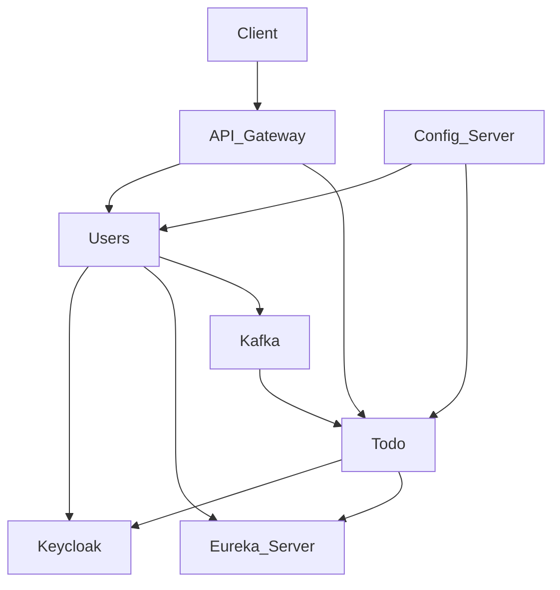

# 🚀 Planner Microservices System with OAuth2

**Modern task management system based on microservices architecture**


[](https://openjdk.org/projects/jdk/17/)  
[](https://spring.io/projects/spring-boot)  
[](https://spring.io/projects/spring-cloud)  
[](https://www.keycloak.org/)  
[](https://www.postgresql.org/)  
[](https://kafka.apache.org/)


## 📖 About the project

Planner is a full-featured system for managing personal tasks, built on a microservices architecture. It ensures secure data storage, flexible task management, and scalability.

## 🏗 System architecture



## 🎯 Microservices

| Service          | Purpose                      | Technologies                         |
|------------------|------------------------------|--------------------------------------|
| planner-gateway  | Single API entry point          | Spring Cloud Gateway, WebFlux         |
| planner-users    | User management       | Keycloak Admin Client, Spring Security OAuth2 |
| planner-todo     | Task management             | Spring Data JPA, Hibernate, PostgreSQL|
| planner-config   | Centralized configuration  | Spring Cloud Config Server            |
| planner-server   | Discovery service             | Spring Cloud Eureka Server            |

## 🛠 Technology Stack

#### 🔧 Backend & Framework

- Java 17 - main development platform
- Spring Boot 3.4.5/3.5.0 - main framework
- Spring Framework 6 - IoC container and dependency management

#### ☁️ Microservices & Cloud

- Spring Cloud 2024.0.1 - cloud ecosystem
- Spring Cloud Config - centralized configuration management
- Spring Cloud Gateway - API Gateway
- Netflix Eureka - service discovery
- Spring Cloud OpenFeign - declarative REST clients

#### 🗄️ Databases & Persistence

- PostgreSQL - primary relational database
- Spring Data JPA - data access abstraction
- Hibernate 6 - ORM provider
- Hibernate Cache - second-level caching
- Hibernate Validator - data validation

#### 🔐 Security & Authentication

- Keycloak 26.0.6 - identity server
- Spring Security 6 - security framework
- OAuth2 Resource Server - OAuth2 authentication
- JWT (JWS) - JSON Web Tokens
- Keycloak Admin Client - user management via Keycloak

#### 📡 Messaging & Communication

- Apache Kafka - event streaming
- Spring Kafka - Kafka integration
- Spring WebFlux - reactive programming

#### 📊 Monitoring & Logging

- Spring Boot Actuator - metrics and monitoring
- Spring AOP - aspect-oriented programming
- Кастомные аспекты - execution time logging

#### 🛠️ Development Tools

- Lombok - boilerplate code reduction
- Spring Boot Configuration Processor - configuration metadata generation
- Jackson - JSON processing

#### 🔄 Resilience & Patterns

- Resilience4j - circuit breaker pattern
- Spring Cloud Circuit Breaker - resilience abstraction
- Feign Error Decoder - HTTP client error handling

#### 🎯 Architectural Styles

- REST API - API architectural style
- Microservices - microservices architecture
- Domain-Driven Design - domain-driven design methodology

## ✨ Key Features

#### 📋 Task Management

- Creating, editing, and deleting tasks
- Categorization and prioritization
- Advanced search with filtering
- Completion statistics
- Date-based scheduling

#### 👥 User Management

- Secure authentication via Keycloak
- Role-based access control (USER/ADMIN)
- Registration and profile management

#### 🛡️ Security

- OAuth2 authentication using JWT
- Method-level authorization
- Protection against unauthorized access
- Integration with Keycloak for centralized user management

## 🚀 Quick Start

#### Prerequisites

- Java 17+
- PostgreSQL 12+
- Keycloak 20+
- Kafka 3+ (optional)
- Maven/Gradle

#### 🏃‍♂️ System Startup

1. **Database setup**:

```sql
CREATE DATABASE planner_todo;
CREATE DATABASE planner_users;
```

2. **Keycloak configuration**:
   - Create a realm
   - Configure client with client credentials
   - Create roles: user, admin

3. **Startup order**:

```bash
# 1. Start PostgreSQL, Keycloak and Kafka
# 2. Start planner-config
# 3. Start planner-server
# 4. Start planner-users
# 5. Start planner-todo
# 6. Start planner-gateway
```

4. **Configuration**:  
   - Settings stored in centralized config server  
   - Profiles:  
     - `micro` - basic microservice settings  
     - `users`/`todo` - service-specific settings  
     - `logging` - logging settings  
     - `kafka` - Kafka integration settings
     - `kc` - Keycloak integration settings
     - `ssl` - SSL security settings

## 📚 API Documentation

### 🔐 Authentication

All requests require JWT token in header:

```http
Authorization: Bearer <your_jwt_token>
``` 

### 🎯Key Endpoints (tested via Postman)  

#### Task Service (planner-todo)  
- `POST /task/add` - Add new task  
- `PUT /task/update` - Update task  
- `DELETE /task/delete/{id}` - Delete task  
- `POST /task/search` - Search tasks with filters  
- `POST /task/all` - All user tasks  

#### User Service (planner-users)  
- `POST /user/add` - Register new user  
- `PUT /user/update` - Update user data  
- `POST /user/deletebyid` - Delete by id  
- `POST /user/search` - Search users  

#### Category Service (planner-todo)  
- `POST /category/add` - Add category  
- `POST /category/search` - Search categories  

#### Priority Service (planner-todo)  
- `POST /priority/add` - Add priority  
- `POST /priority/all` - All user priorities 


### 📊 Postman Request Examples 

### Create User  
```http
POST https://localhost:8765/planner-users/admin/user/add
Content-Type: application/json

{
    "username": "newUser14",
    "email": "new14@mail.ru",
    "password": "sfgvb"
}
```

### Create Task  
```http
POST http://localhost:8765/planner-todo/task/add
Content-Type: application/json

{
    "title": "Finish project",
    "completed": false,
    "taskDate": "2025-06-01",
    "category": {
        "id": 25
    },
    "priority": {
        "id": 17
    }
}
```

## 💡 Future Development 

- React/Vue.js SPA with modern UI/UX
- Docker containerization for all services
- Generate unit tests


## 📄 License

MIT License
